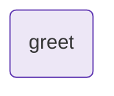

# agent-echo

Smallest LLM-backed OpenExpertise experience. One agent node.

Requires `ANTHROPIC_API_KEY` in the environment:

## Diagram

<!-- oe-graph:start (generated by scripts/gen-example-diagrams.mjs — do not edit by hand) -->



<!-- oe-graph:end -->

```bash
export ANTHROPIC_API_KEY=sk-...
oe run examples/agent-echo --args '{"name":"Alice"}'
```

Expected: `greeting` state field is set to a one-sentence greeting from the model.
