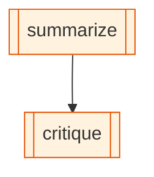

# cli-orchestration

Smallest demo of the `cli-agent` node kind. Two nodes:

1. `summarize` — Claude Code writes a 3-sentence summary
2. `critique` — Codex critiques it

## Diagram

<!-- oe-graph:start (generated by scripts/gen-example-diagrams.mjs — do not edit by hand) -->



<!-- oe-graph:end -->

## Prereqs

Both `claude` and `codex` must be on `PATH` and authenticated. Run `claude` and `codex` once interactively first if you haven't.

## Run

```bash
oe run examples/cli-orchestration
```

The topic is set via the `summarize` node's static `args.topic` in `experience.yaml`. Edit that line to point at a different topic. (Run-level `--args` are not auto-propagated into node bundles in V1; for dynamic topics, replace `args` with a seed `tool` node that writes `topic` to state.)

## What it shows

- Two providers in one graph
- State flow: `summary` written by node 1 is read by node 2 via `{{summary}}`
- Sequential edge ordering (`summarize → critique`)
