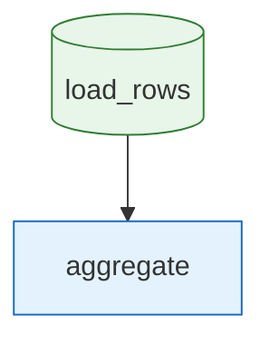

# dataset-aggregate

Load a CSV (dataset node) then aggregate it (tool node).

## Diagram

<!-- oe-graph:start (generated by scripts/gen-example-diagrams.mjs — do not edit by hand) -->



<!-- oe-graph:end -->

```bash
oe run examples/dataset-aggregate
```

Expected final state: `{ rows: [...], total: 60 }`.
