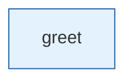

# hello-tool

Smallest OpenExpertise experience. Walks through one tool node.

## Diagram

<!-- oe-graph:start (generated by scripts/gen-example-diagrams.mjs — do not edit by hand) -->



<!-- oe-graph:end -->

```bash
oe validate examples/hello-tool
oe run examples/hello-tool --args '{}'
```

Expected: `greeting` state field is set to `hello, World`.
