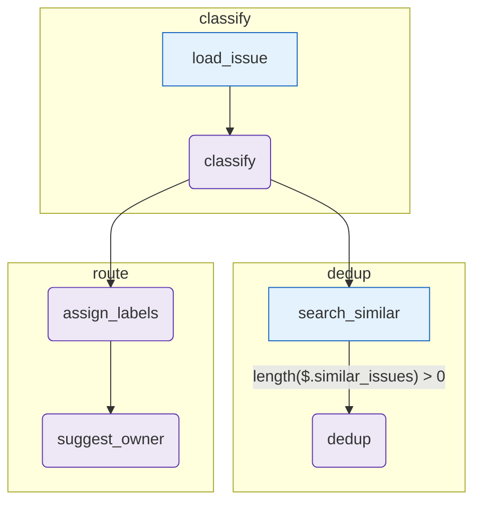

# issue-triage

Triage an incoming GitHub issue through 5 steps:

1. **classify phase**
   - `load_issue` (tool) — pulls the issue body from fixtures.
   - `classify` (agent) — picks `type`, `severity`, `area`.
2. **dedup phase**
   - `search_similar` (tool) — stub vector search over `fixtures/historical_issues.json`.
   - `dedup` (agent) — _conditional edge: only runs if `length($.similar_issues) > 0`._ Determines if the issue is a duplicate and of what.
3. **route phase**
   - `assign_labels` (agent) — proposes labels based on classification.
   - `suggest_owner` (agent) — proposes a routing handle.

Demonstrates: `tool → agent` chaining, **`when:` conditional edges** to skip work when there are no candidates, and parallel-ish "fan-in" from `classify` + `dedup` to `assign_labels`.

## Diagram

<!-- oe-graph:start (generated by scripts/gen-example-diagrams.mjs — do not edit by hand) -->



<!-- oe-graph:end -->

## Run

```bash
export ANTHROPIC_API_KEY=sk-...
oe run examples/issue-triage --tui
```

Replace `fixtures/issue.json` with a real GitHub issue payload, or replace `load_issue.mjs` with a call to the GitHub REST API.

## Mocked e2e

`e2e/issue-triage.e2e.test.ts` exercises the full graph with a scripted LLM — no API key required.
