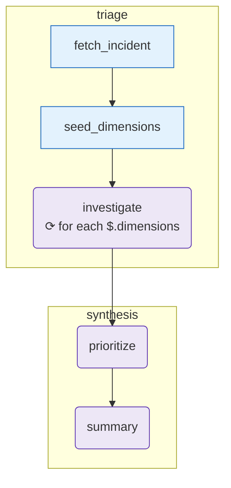

# oncall-runbook

When an incident fires, run a structured triage:

1. **Triage phase**
   - `fetch_incident` (tool) — loads the incident metadata.
   - `seed_dimensions` (tool) — sets up 3 investigation angles.
   - `investigate` (agent, fanned out via `for_each` over dimensions) — produces findings per angle.
2. **Synthesis phase**
   - `prioritize` (agent) — ranks findings.
   - `summary` (agent) — writes the oncall-facing one-pager.

Demonstrates: tool → agent fan-out (`for_each`) → sequential agents → structured output throughout.

## Diagram

<!-- oe-graph:start (generated by scripts/gen-example-diagrams.mjs — do not edit by hand) -->



<!-- oe-graph:end -->

## Run

```bash
export ANTHROPIC_API_KEY=sk-...   # or OPENAI_API_KEY=...
oe run examples/oncall-runbook --tui
```

Replace `fixtures/incident.json` with a real PagerDuty payload to triage a different incident, or replace `fetch_incident.mjs` with a call to the PagerDuty API.

## Mocked e2e

`e2e/oncall-runbook.e2e.test.ts` exercises the full graph with a scripted LLM — no API key required.
