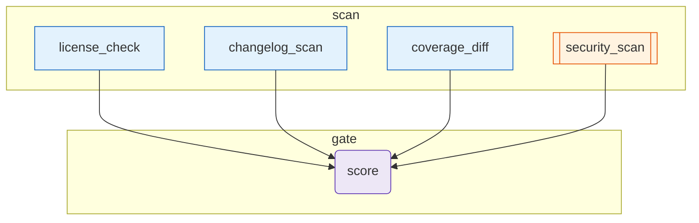

# release-gates

Pre-release gate that runs four independent checks in the `scan` phase, then a single agent in the `gate` phase aggregates them into a release/no-release decision.

1. **scan phase** (parallel-friendly; sequential in V1's scheduler)
   - `license_check` (tool) — verifies each dep against an allow-list (`MIT, BSD-3-Clause, Apache-2.0, ISC`).
   - `changelog_scan` (tool) — flags lines marked `[BREAKING]` or `BREAKING` in the changelog.
   - `coverage_diff` (tool) — computes line-coverage delta between two snapshots.
   - `security_scan` (**cli-agent / claude-code**) — hands the diff to Claude Code for a security review with structured JSON output.
2. **gate phase**
   - `score` (agent) — weights all four inputs and returns `{ ready_to_release, score, blocking_issues, recommendation }`.

Demonstrates: **mixing `tool` + `cli-agent` + `agent` in one experience**, four sibling nodes converging into one downstream node, and JSON-mode parsing on a CLI agent.

## Diagram

<!-- oe-graph:start (generated by scripts/gen-example-diagrams.mjs — do not edit by hand) -->



<!-- oe-graph:end -->

## Run

```bash
export ANTHROPIC_API_KEY=sk-...           # for the `score` agent
# `claude` CLI must be on PATH and authenticated for `security_scan`
oe run examples/release-gates --tui
```

Replace `fixtures/diff.txt` with the actual unified diff of your release branch.

## Mocked e2e

`e2e/release-gates.e2e.test.ts` exercises the graph with a scripted LLM (for the score agent) and a scripted subprocess runner (for the security_scan cli-agent) — no API key, no CLI required.
