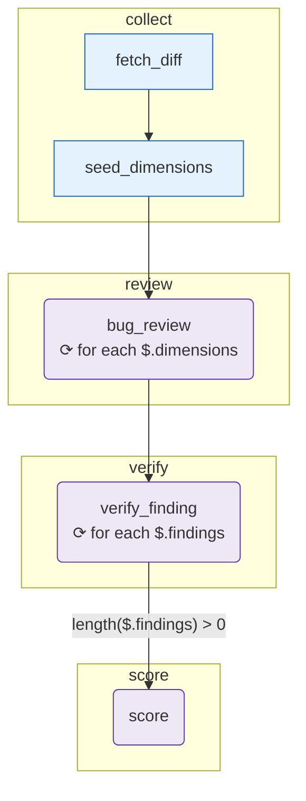

# review-branch

The canonical OpenExpertise demo — fan-out + pipeline + conditional + agent + structured output.

## Diagram

<!-- oe-graph:start (generated by scripts/gen-example-diagrams.mjs — do not edit by hand) -->



<!-- oe-graph:end -->

```bash
export ANTHROPIC_API_KEY=sk-...
oe run examples/review-branch --args '{"pr_id":"PR-1234"}'
```

CI / unattended testing uses the mocked Anthropic client in `e2e/review-branch.e2e.test.ts`.
