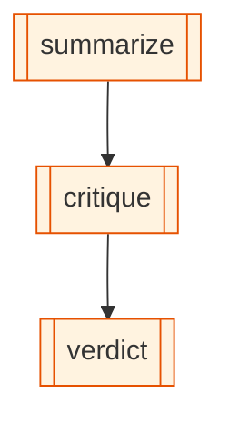

# tri-cli-orchestration

The headline cross-vendor demo. Three rival agentic CLIs in a single OpenExpertise graph, talking to each other through shared SQLite state:

## Diagram

<!-- oe-graph:start (generated by scripts/gen-example-diagrams.mjs — do not edit by hand) -->



<!-- oe-graph:end -->

```
┌──────────────┐      ┌────────────┐      ┌──────────────┐
│  Claude Code │  ──▶ │   Codex    │  ──▶ │    Gemini    │
│  (summarize) │      │ (critique) │      │  (verdict)   │
└──────────────┘      └────────────┘      └──────────────┘
       summary  ─────────────▶  summary + critique  ────▶  verdict
                            (state flows via {{interpolation}})
```

No other workflow framework today orchestrates Claude Code, OpenAI Codex, and Google Gemini in one graph. OpenExpertise does it because `cli-agent` is a first-class node kind.

## Prereqs

All three CLIs must be on `PATH` and authenticated. Each invokes its own provider's API.

```bash
which claude codex gemini
```

If any are missing, install them per their vendors' instructions and run them once interactively to authenticate.

## Run

```bash
oe run examples/tri-cli-orchestration --tui
```

The TUI shows each node's status, current activity (`spawning claude-code`, `spawning codex`, `spawning gemini`), and elapsed time per stage. Real wall-clock time for one round trip: roughly 30–60 seconds end-to-end (three sequential LLM calls).

## A real run

State after one execution (topic: _"In-memory caching strategies for HTTP APIs"_):

> **summary** (Claude Code):
> _In-memory caching strategies for HTTP APIs store frequently requested response data directly in application memory to reduce latency, lower backend load, and improve throughput, using techniques like time-based expiration, LRU eviction, and cache invalidation on writes._
>
> **critique** (Codex):
> _It misses that in-memory caches are per-process, so horizontally scaled APIs can serve inconsistent or stale data across instances unless you add coordination or use a distributed cache._
>
> **verdict** (Gemini):
> _No; specify that in-memory caches are per-process, which can lead to data inconsistency across horizontally scaled API instances._

Each step's output landed in the SQLite blackboard (`oe state summary`, `oe state critique`, `oe state verdict`) and the full event log replays via `oe inspect <run-id>`.

## Mocked e2e

`e2e/tri-cli-orchestration.e2e.test.ts` exercises the full graph with a scripted subprocess runner — no real CLIs required. CI runs this on every commit.

## Why it matters

If you can chain three rival vendor CLIs deterministically and capture each step's output as structured state, you can:

- Cross-check one model's claims with a competitor's review.
- Route different subtasks to whichever CLI has the right tools / pricing / model strengths.
- A/B different summarize→critique→verdict variants and let the evolution advisor pick the best one across runs.

This is what `cli-agent` was built for.
