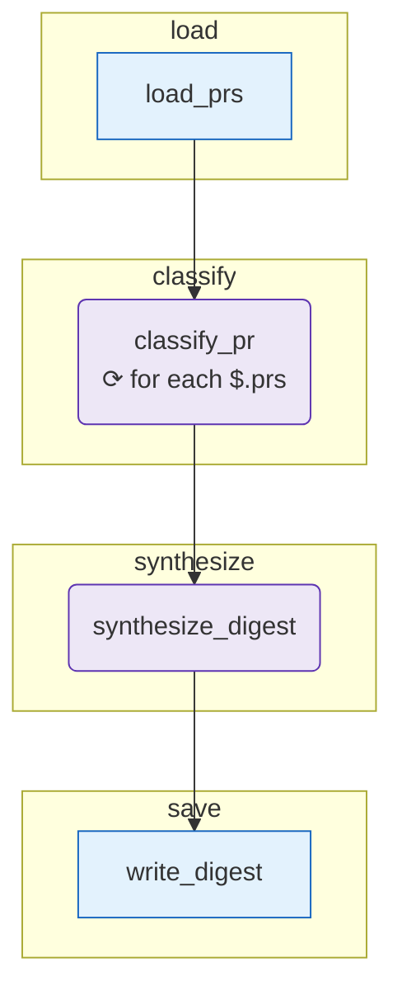

# your-first-experience

The canonical reference implementation for the [Your first experience](/guide/first-experience) tutorial. If you're following the tutorial and got stuck, your repo should end up looking like this.

## Diagram

<!-- oe-graph:start (generated by scripts/gen-example-diagrams.mjs — do not edit by hand) -->



<!-- oe-graph:end -->

## What it does

A weekly engineering digest:

```
load_prs (tool)
  → classify_pr (agent, for_each over 8 PRs, concurrency 3)
    → synthesize_digest (agent, 5-bullet summary)
      → write_digest (tool, writes ./out/digest.md)
```

## Prereqs

- `ANTHROPIC_API_KEY` or `OPENAI_API_KEY` (for both agents).

## Run

```bash
oe validate
oe run .
cat $(oe state digest_path)
```

Expected wall time: ~45 seconds (8 PRs classified in parallel + 1 synthesis call + 1 file write).

## What this demonstrates

This is THE canonical "all 4 common node kinds composing cleanly" example. If you only read one example before authoring your own, read this one.

- **`tool` for input/output** — `load_prs` reads a fixture; `write_digest` writes a Markdown report. The reader knows where data enters and leaves.
- **`agent` with `for_each` fan-out + structured output** — classifying each PR in parallel, with AJV-validated category enum.
- **`agent` for synthesis** — chaining a second LLM call that consumes the structured outputs of the first.
- **`merge: array_append`** — the `classified` state field accumulates contributions from every fan-out iteration.

## Variations

- Swap the fixture for a live HTTP source: change `load_prs` to a `dataset` node with `source.type: http` and `url: https://api.github.com/repos/<owner>/<repo>/pulls?state=closed&per_page=8`. You'll need a `GITHUB_TOKEN` for non-anonymous access.
- Add an `evolve`-friendly `category_summary` agent that produces a one-line summary per category (good source for `oe evolve` to refine the synthesizer prompt over multiple weeks).
- Add a `cli-agent` step that runs Claude Code against the digest to suggest follow-up items for next week.

## See also

- [Your first experience](/guide/first-experience) — the tutorial walks through building this end-to-end.
- [`/cookbook/fan-out-with-concurrency`](/cookbook/fan-out-with-concurrency) — the pattern used by `classify_pr`.
- [`/concepts/node-agent`](/concepts/node-agent) — agent node fundamentals.
