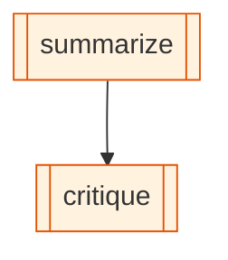

# cli-orchestration

_The minimal two-CLI demo: Claude Code writes a three-sentence summary; Codex reads it from state and critiques it — both in a single graph, state flowing between them via `{{interpolation}}`._

## What it demonstrates

- [`cli-agent`](/concepts/node-cli-agent) node kind — spawning real agentic CLIs as graph nodes
- Two different providers (`claude-code`, `codex`) in one experience
- State interpolation in prompts: `{{summary}}` resolves from the SQLite blackboard
- Sequential CLI-to-CLI chaining

## The graph

<!-- oe-graph:start (generated by scripts/gen-example-diagrams.mjs — do not edit by hand) -->



<!-- oe-graph:end -->

```yaml
graph:
  nodes:
    - id: summarize
      kind: cli-agent
      provider: claude-code
      prompt: |
        Write a 3-sentence summary of the following topic. Just the summary,
        no preamble.
        Topic: {{topic}}
      args:
        topic: 'In-memory caching strategies for HTTP APIs'
      writes: [summary]
      timeout_ms: 120000
    - id: critique
      kind: cli-agent
      provider: codex
      prompt: |
        Critique this summary in 2 sentences. Be specific about what's missing
        or wrong. Just the critique, no preamble.
        Summary: {{summary}}
      reads: [summary]
      writes: [critique]
      timeout_ms: 120000
  edges:
    - { from: summarize, to: critique }
```

## State schema

| Field      | Type     | Description                                 |
| ---------- | -------- | ------------------------------------------- |
| `topic`    | `string` | Subject; set in `summarize`'s static `args` |
| `summary`  | `string` | Claude Code's 3-sentence summary            |
| `critique` | `string` | Codex's 2-sentence critique                 |

## How it runs

Both `claude` and `codex` must be on `PATH` and authenticated. Run each once interactively to complete their setup flows before using them here.

```bash
which claude codex   # both must resolve
oe run examples/cli-orchestration
```

No `ANTHROPIC_API_KEY` needed — each CLI handles its own auth against its own provider's API.

## What happens

1. `summarize` is dispatched to `CliAgentDispatcher` with `provider: claude-code`. The dispatcher spawns `claude` with the interpolated prompt (topic resolved from `args`). Claude's stdout is captured and written to `summary` in state.
2. `critique` waits for `summarize` to finish (sequential edge). The dispatcher spawns `codex` with the critique prompt — `{{summary}}` is resolved from the blackboard before the process is started.
3. Codex's stdout is written to `critique`.

```
$ oe state summary
In-memory caching stores response data in RAM to cut latency...

$ oe state critique
It omits that per-process caches cause inconsistency at horizontal scale...
```

::: tip State flows through {{interpolation}}
The `{{summary}}` placeholder in Codex's prompt is resolved at dispatch time by reading the current value from the SQLite blackboard. This is how all inter-node communication works in OpenExpertise — see [State](/concepts/state) for details.
:::

## Try it: variations

**1. Change the topic.**
Edit `args.topic` in the YAML to any subject. Rerun — no other changes needed.

**2. Add a third model.**
This example is one step away from [tri-cli-orchestration](/examples/tri-cli-orchestration): just add a `verdict` node with `provider: gemini` that reads `{{summary}}` and `{{critique}}`. See that walkthrough for the full three-way setup.

**3. Make the topic dynamic.**
Replace the static `args.topic` with a `seed_topic` tool node that writes `topic` to state from a file or CLI arg, and update the `summarize` prompt to read `{{topic}}` from state. The V1 caveat: run-level `--args` are not auto-propagated into node prompt interpolation — a seed node is the idiomatic workaround.

## Source

[examples/cli-orchestration/](https://github.com/xingchengxu/OpenExpertise/tree/main/examples/cli-orchestration)
