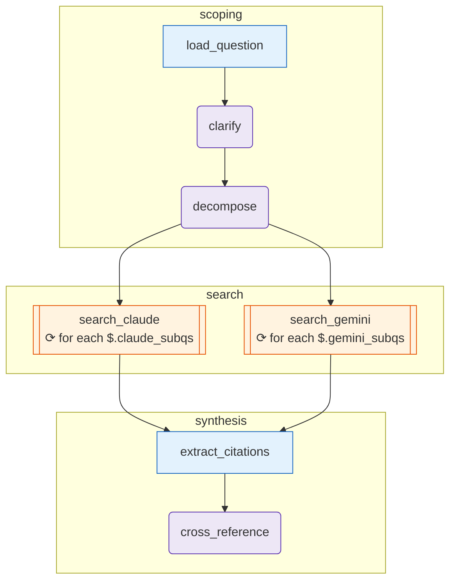

# deep-research

_A real deep-research pipeline: an agent clarifies the question and plans the work, then Claude Code and Gemini search their respective strengths in parallel (`for_each` fan-out on both), and a synthesis agent cross-references all findings into a cited summary._

## What it demonstrates

- Multi-phase pipeline: `scoping → search → synthesis`
- Dual `for_each` fan-out across two [`cli-agent`](/concepts/node-cli-agent) nodes simultaneously (`search_claude` and `search_gemini` as siblings)
- `for_each.concurrency: 2` — per-node iteration parallelism
- `array_append` merge: raw findings from both CLIs accumulate into one list
- Fan-in: both `search_*` nodes converge on `extract_citations`
- Structured JSON output from CLI agents
- Multi-vendor by design: Claude's WebSearch for technical/academic, Gemini's Google Search for current-events

## The graph

<!-- oe-graph:start (generated by scripts/gen-example-diagrams.mjs — do not edit by hand) -->



<!-- oe-graph:end -->

```
load_question → clarify → decompose ┬─ search_claude (for_each, concurrency:2)
                                    └─ search_gemini (for_each, concurrency:2)
                                                │
                                                ▼ (fan-in)
                                       extract_citations
                                                │
                                                ▼
                                       cross_reference
```

Phases: `scoping` → `search` → `synthesis`.

## State schema

| Field                | Type            | Merge          | Description                                             |
| -------------------- | --------------- | -------------- | ------------------------------------------------------- |
| `question`           | `string`        | —              | Raw question from `fixtures/question.json`              |
| `clarified_question` | `string`        | —              | Narrowed question from the `clarify` agent              |
| `assumptions`        | `array<string>` | —              | Assumptions the clarifier surfaced                      |
| `research_plan`      | `object`        | —              | Rationale + parallelism strategy from `decompose`       |
| `claude_subqs`       | `array<object>` | —              | Sub-questions assigned to Claude                        |
| `gemini_subqs`       | `array<object>` | —              | Sub-questions assigned to Gemini                        |
| `raw_findings`       | `array<object>` | `array_append` | All claims + evidence + URLs from both CLIs             |
| `citations`          | `array<string>` | —              | Deduplicated URLs extracted by `extract_citations.mjs`  |
| `cross_referenced`   | `object`        | —              | `{executive_summary, key_findings[], open_questions[]}` |

## How it runs

```bash
export ANTHROPIC_API_KEY=sk-...   # for clarify, decompose, cross_reference agents
# claude and gemini CLIs must be on PATH and authenticated
# Edit fixtures/question.json to your question first
oe run examples/deep-research --tui --concurrency 4
```

::: warning Both CLIs required
`search_claude` uses `claude` CLI (WebSearch tool must be enabled — it is by default). `search_gemini` uses `gemini` CLI (Google Search grounding enabled by default). If you only have one, set `claude_subqs: []` or `gemini_subqs: []` in a seed tool node to skip that branch.
:::

Expect 3–8 minutes wall time. With `--concurrency 4`, sibling `search_*` nodes run concurrently and each node's `for_each` iterations run 2-at-a-time.

## What happens

### Scoping phase

1. `load_question` reads `fixtures/question.json`.
2. `clarify` narrows the question and surfaces assumptions.
3. `decompose` splits the work: technical/historical sub-questions go to `claude_subqs`, recent/current-events sub-questions go to `gemini_subqs`. The decomposition rationale is stored in `research_plan`.

### Search phase (parallel)

`search_claude` fans out over `claude_subqs` — one Claude Code invocation per sub-question, up to 2 concurrent:

```yaml
for_each: { source: $.claude_subqs, concurrency: 2 }
```

Each iteration receives `$item` (the sub-question) and asks Claude to use WebSearch for at least 3 sources, returning structured JSON:

```json
{ "raw_findings": [{ "sub_question_id": "c1", "claim": "...", "evidence": "...", "url": "..." }] }
```

`search_gemini` does the same over `gemini_subqs` using Gemini's Google Search grounding. Both nodes write to `raw_findings` with `array_append` — all findings from both CLIs accumulate into one flat list.

### Synthesis phase

`extract_citations` deduplicates all URLs in `raw_findings` into a `citations` list.

`cross_reference` reads `clarified_question`, `raw_findings`, and `citations` and produces:

```json
{
  "executive_summary": "...",
  "key_findings": [{"claim": "...", "supporting_urls": [...], "conflicts": "..."}],
  "open_questions": ["..."]
}
```

The `conflicts` field flags when Claude's findings and Gemini's findings disagree.

## Inspect the result

```bash
oe state cross_referenced
oe state citations           # all URLs referenced
oe inspect <run-id>          # full event log, sorted by timestamp
```

Results are cached: re-running with `oe resume <run-id>` replays only nodes whose inputs changed (typically just `cross_reference` if you edit the synthesis prompt).

## Try it: variations

**1. Change the question.**
Edit `fixtures/question.json` to your research question. The decomposer will split it appropriately.

**2. Add a fact-checker.**
Insert a `fact_check` `cli-agent` node between `search_*` and `extract_citations` that challenges each finding with a web search for counter-evidence. Wire it as: both `search_*` → `fact_check` → `extract_citations`.

**3. Add a third vendor.**
Mirror the `claude_subqs` / `gemini_subqs` pattern with `codex_subqs`. Add a `search_codex` `cli-agent` node with `provider: codex`. Update `decompose.md` to produce a third sub-question array. Add the edge to the fan-in.

**4. Scale concurrency.**
Increase `for_each.concurrency: 4` and `--concurrency 8` if you have many sub-questions and your provider rate limits allow it. See [Concurrency](/guide/concurrency) for retry-backoff behaviour.

::: tip Evolution after runs
After 3+ runs, `oe evolve` typically proposes:

- An academic-paper specialist (cli-agent with Semantic Scholar MCP)
- A source-credibility scorer between search and synthesis
- Routing code-heavy sub-questions to Codex instead of Claude
  :::

## Source

[examples/deep-research/](https://github.com/xingchengxu/OpenExpertise/tree/main/examples/deep-research)
