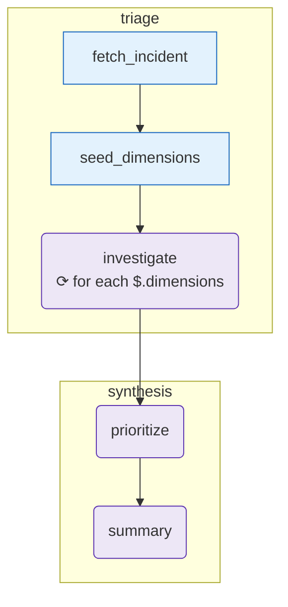

# oncall-runbook

_When an incident fires, run a structured triage: fetch the incident, investigate across three independent angles in parallel (`for_each` fan-out), rank the findings, and produce a one-page summary for the oncall engineer._

## What it demonstrates

- `tool → agent` chaining across two phases
- [`for_each`](/concepts/control-flow) fan-out on the `investigate` node (one agent call per dimension)
- `array_append` merge strategy for accumulating findings from parallel iterations
- Sequential synthesis: ranked findings → prose summary
- Multi-LLM compatibility (`ANTHROPIC_API_KEY` or `OPENAI_API_KEY`)

## The graph

<!-- oe-graph:start (generated by scripts/gen-example-diagrams.mjs — do not edit by hand) -->



<!-- oe-graph:end -->

```
┌───────────────┐   ┌────────────────┐
│ fetch_incident│   │ seed_dimensions│
└──────┬────────┘   └───────┬────────┘
       │  triage phase      │
       └────────────────────┘
                │
                ▼
       ┌─────────────────┐
       │   investigate   │  ← for_each over dimensions (×3)
       └────────┬────────┘
                │  synthesis phase
                ▼
          ┌──────────┐
          │ prioritize│
          └─────┬────┘
                ▼
           ┌────────┐
           │ summary│
           └────────┘
```

Phases: `triage` → `synthesis`.

## State schema

| Field                  | Type            | Merge          | Description                                          |
| ---------------------- | --------------- | -------------- | ---------------------------------------------------- |
| `incident`             | `object`        | —              | Raw incident payload                                 |
| `dimensions`           | `array<object>` | —              | Investigation angles seeded by `list_dimensions.mjs` |
| `findings`             | `array<object>` | `array_append` | Accumulated from each `investigate` iteration        |
| `prioritized_findings` | `array<object>` | —              | Ranked by the `prioritize` agent                     |
| `summary`              | `string`        | —              | Oncall-facing one-pager                              |

## How it runs

```bash
export ANTHROPIC_API_KEY=sk-...   # or OPENAI_API_KEY=...
oe run examples/oncall-runbook --tui
```

No special CLIs required. The `--tui` flag shows a live dashboard of node statuses and elapsed time.

## What happens

1. **triage phase** — `fetch_incident` loads `fixtures/incident.json` into state. `seed_dimensions` writes three investigation angles: `service_health`, `infra_layer`, `dependency_failures`.
2. **fan-out** — `investigate` runs once per dimension (three concurrent-ish calls in V1's sequential scheduler). Each call reads `incident` and the current `$item` dimension, returns structured `findings[]`. The `array_append` merge concatenates all three result arrays into one flat `findings` list.
3. **synthesis phase** — `prioritize` reads all findings + the incident and returns a ranked `prioritized_findings[]`. `summary` reads the incident + ranked findings and writes a human-readable `summary` string.

Sample final state:

```
$ oe state summary
[oncall one-pager prose...]

$ oe state prioritized_findings | head -5
[{"title": "Payment service 500 rate 12%", "priority": "P1"}, ...]
```

## Fixtures

`fixtures/incident.json` contains a sample PagerDuty-style incident payload. Replace it with a real incident to triage a live event.

## Try it: variations

**1. Add a fourth dimension.**
Edit `list_dimensions.mjs` to return a fourth object, e.g. `{ key: "data_layer", focus: "database slow queries" }`. The `for_each` fan-out automatically picks it up — no graph changes needed.

**2. Point at a real PagerDuty API.**
Replace `fetch_incident.mjs` with a fetch call to the PagerDuty REST API (using the incident ID from `--args`). The rest of the graph is unchanged.

**3. Add a Slack-post tool node.**
Append a `post_summary` tool node after `summary` that POSTs `summary` to a Slack webhook. Chain `{ from: summary, to: post_summary }`.

## Source

[examples/oncall-runbook/](https://github.com/xingchengxu/OpenExpertise/tree/main/examples/oncall-runbook)
