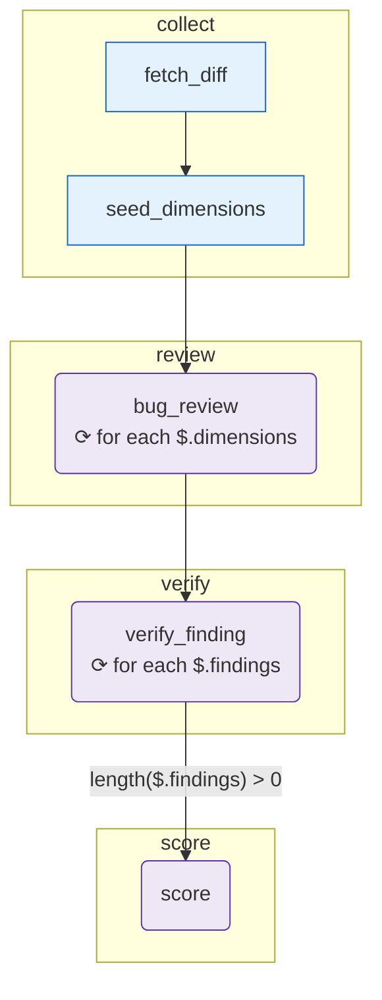

# review-branch

_The canonical OpenExpertise demo: review a code diff across three independent dimensions (bugs, performance, tests), verify every finding adversarially, then score the branch — all in one structured graph._

## What it demonstrates

- [`for_each`](/concepts/control-flow) fan-out on an `agent` node — one review call per dimension
- `array_append` merge strategy: findings from parallel iterations accumulate into one list
- Adversarial verify step: a second `for_each` fan-out challenges every finding
- `when:` conditional edge: `score` only runs if at least one finding survived verification
- Structured output with JSON schema enforcement on every agent node
- The full author → run → [evolve](/concepts/evolution-loop) closed loop

## The graph

<!-- oe-graph:start (generated by scripts/gen-example-diagrams.mjs — do not edit by hand) -->



<!-- oe-graph:end -->

```
fetch_diff ──► seed_dimensions
                    │
                    ▼
             bug_review (agent)          ← for_each over dimensions ×3
                    │
                    ▼
           verify_finding (agent)        ← for_each over findings ×N
                    │
                    │  when: length($.findings) > 0
                    ▼
                 score (agent)
```

Phases: `collect` → `review` → `verify` → `score`.

## State schema

| Field               | Type            | Merge          | Description                                   |
| ------------------- | --------------- | -------------- | --------------------------------------------- |
| `pr_id`             | `string`        | —              | PR identifier passed via `--args`             |
| `diff`              | `string`        | —              | Raw unified diff loaded by `fetch_diff.mjs`   |
| `dimensions`        | `array<object>` | —              | `[{key:"bugs"}, {key:"perf"}, {key:"tests"}]` |
| `findings`          | `array<object>` | `array_append` | Accumulated from all three review iterations  |
| `verified_findings` | `array<object>` | `array_append` | Accumulated from all verify iterations        |
| `risk_score`        | `number`        | —              | `[0,1]` risk score from the score agent       |

## How it runs

```bash
export ANTHROPIC_API_KEY=sk-...
oe run examples/review-branch --args '{"pr_id":"PR-1234"}'
```

No special CLIs required. CI uses a mocked `LLMClient` — see `e2e/review-branch.e2e.test.ts`.

## The fixture: `add-user-lookup.diff`

The bundled diff adds a `/users/<user_id>` Flask route:

```python
@app.route("/users/<user_id>", methods=["GET"])
def get_user(user_id):
    cursor = db.cursor()
    cursor.execute(f"SELECT id, name, email FROM users WHERE id={user_id}")
    row = cursor.fetchone()
    return {"id": row[0], "name": row[1], "email": row[2]}
```

Two problems visible to a careful reviewer:

1. **SQL injection** — `user_id` is string-interpolated directly into the query.
2. **Missing tests** — the `# TODO: add tests` comment is right there in the diff.

The `perf` dimension may also flag a missing index, depending on the model.

## What happens, step by step

### 1. Collect phase

`fetch_diff` reads `fixtures/add-user-lookup.diff` and writes it to the `diff` state field.

`seed_dimensions` returns three dimensions:

```json
[
  { "key": "bugs", "focus": "logic errors" },
  { "key": "perf", "focus": "regressions" },
  { "key": "tests", "focus": "missing coverage" }
]
```

### 2. Review phase — fan-out

`bug_review` runs three times via `for_each: { source: $.dimensions }`. Each iteration receives `$item` as the current dimension and the full `diff`. The prompt instructs each reviewer to stay in their lane:

```md
You are the **{{$item.key}}** reviewer.
Focus ONLY on {{$item.focus}}. Do NOT report issues outside this scope —
other reviewers handle other dimensions, and out-of-scope findings will be discarded.
```

Typical output from three iterations:

| Dimension | Finding                                                              |
| --------- | -------------------------------------------------------------------- |
| `bugs`    | "SQL injection via f-string interpolation" (high)                    |
| `perf`    | "No DB index on users.id; full-table scan on every request" (medium) |
| `tests`   | "No test for `/users/<id>` endpoint" (medium)                        |

All three arrays are merged via `array_append` into `findings` (length 3).

### 3. Verify phase — adversarial fan-out

`verify_finding` runs once per entry in `findings`. The verify prompt takes an adversarial stance:

```md
You are an adversarial verifier. A reviewer has flagged this issue:
**{{$item.title}}** (severity: {{$item.severity}})

Decide whether this finding is a real, actionable issue in the given diff.
Reject findings that are speculative, out-of-scope, or not supported by the diff.
```

For the SQL injection finding, the verifier will confirm `is_real: true` — the f-string is right there. For a hypothetical "password stored in plaintext" finding, the verifier would set `is_real: false` (nothing in this diff touches passwords).

After three verify calls, `verified_findings` contains each finding's verdict.

### 4. Score phase — conditional

The edge to `score` carries `when: 'length($.findings) > 0'`. If somehow no findings survived (clean diff), `score` is skipped entirely.

For this fixture, all three findings verify as real → `risk_score: 0.75` (one high, two medium).

```
$ oe state risk_score
0.75

$ oe state verified_findings
[
  {"title": "SQL injection via f-string interpolation", "severity": "high", "is_real": true},
  {"title": "No DB index on users.id", "severity": "medium", "is_real": true},
  {"title": "No test for /users/<id> endpoint", "severity": "medium", "is_real": true}
]
```

## The closed loop: evolve after a run

After running the experience, the [evolution advisor](/concepts/evolution-loop) can propose graph improvements:

```bash
oe evolve <run-id>
```

Typical proposals for this graph:

- **Add a `security` dimension** — the `bugs` reviewer caught the SQL injection, but a dedicated security dimension would also flag missing authentication and rate limiting.
- **Add an `auth` verifier** — a specialized verify agent that cross-references findings against OWASP Top 10.
- **Add a `patch_proposal` node** — after `score`, add a `cli-agent / claude-code` node that proposes actual code fixes for each `is_real: true` finding.

To apply a proposal, copy the `.openexpertise/evolution/<run-id>.md` file's YAML diff into `experience.yaml` and re-run.

## Why 3 dimensions catch what 1 reviewer misses

A single "review everything" agent prompt tends to fixate on the most obvious issue and report the others superficially. By scoping each reviewer strictly to one dimension — and having the prompt say "do NOT report outside this scope" — you get deeper coverage within each lane.

The adversarial verify step then filters false positives without requiring a human in the loop. The result is a high-precision finding list that can feed automated tooling (patch proposals, JIRA tickets, CI gates).

## Try it: variations

**1. Add a `security` dimension.**
Edit `list_dimensions.mjs` to add `{ key: "security", focus: "injection, auth, secrets" }`. The `bug_review` fan-out automatically gains a fourth iteration.

**2. Swap the diff.**
Replace `fixtures/add-user-lookup.diff` with `git diff origin/main...HEAD` of your current branch and review your own changes.

**3. Lower the score threshold in CI.**
After running, check `oe state decision` with a shell script: if `risk_score > 0.6`, fail the CI step and print the blocking findings.

::: tip Hero example
This is the most complete single-graph example in the repository. It exercises `for_each`, `when:`, `array_append`, multi-phase structured output, and the evolution loop in one experience — about 85 lines of YAML.
:::

## Source

[examples/review-branch/](https://github.com/xingchengxu/OpenExpertise/tree/main/examples/review-branch)
