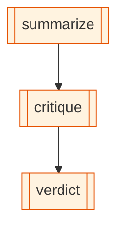

# tri-cli-orchestration

_Three rival agentic CLIs from three competing vendors — Claude Code, OpenAI Codex, and Google Gemini — orchestrated in a single graph: Claude summarizes, Codex critiques, Gemini delivers the verdict. All sharing state through OpenExpertise's SQLite blackboard._

## What it demonstrates

- Three [`cli-agent`](/concepts/node-cli-agent) nodes with three different providers (`claude-code`, `codex`, `gemini`)
- State flowing between rival CLIs via `{{interpolation}}` — each CLI's output becomes the next one's input
- Sequential chaining: `summarize → critique → verdict`
- No LLM API key required — each CLI handles its own provider auth
- The fundamental "cross-vendor AI pipeline" pattern that no other framework supports today

## The graph

<!-- oe-graph:start (generated by scripts/gen-example-diagrams.mjs — do not edit by hand) -->



<!-- oe-graph:end -->

```
┌──────────────┐      ┌────────────┐      ┌──────────────┐
│  Claude Code │  ──▶ │   Codex    │  ──▶ │    Gemini    │
│  (summarize) │      │ (critique) │      │  (verdict)   │
└──────────────┘      └────────────┘      └──────────────┘
       summary  ─────────────▶  summary + critique  ────▶  verdict
                            (state flows via {{interpolation}})
```

```yaml
edges:
  - { from: summarize, to: critique }
  - { from: critique, to: verdict }
```

## State schema

| Field      | Type     | Description                                 |
| ---------- | -------- | ------------------------------------------- |
| `topic`    | `string` | Subject; set in `summarize`'s static `args` |
| `summary`  | `string` | Claude Code's one-sentence summary          |
| `critique` | `string` | Codex's one-sentence critique               |
| `verdict`  | `string` | Gemini's one-sentence go/no-go verdict      |

## How it runs

All three CLIs must be installed, on `PATH`, and authenticated:

```bash
which claude codex gemini   # all three must resolve
```

If any are missing, install them from their vendor's documentation and run each once interactively to complete auth.

```bash
oe run examples/tri-cli-orchestration --tui
```

The `--tui` dashboard shows each node's status (`spawning claude-code`, `running`, `done`) and elapsed time per stage.

::: tip No API key configuration in OE
Each CLI talks to its own vendor's API using its own stored credentials. OpenExpertise never touches API keys for `cli-agent` nodes — it just spawns the process and captures stdout.
:::

## What the prompts do

Each node has a tightly scoped, one-sentence-output prompt. This keeps the state values small and makes the state flow easy to trace.

**summarize (Claude Code):**

```
Write a single-sentence summary of the topic.
No preamble, no markdown.

Topic: {{topic}}
```

**critique (Codex):**

```
In one sentence, point out the single biggest thing this summary misses.
Be specific. No preamble.

Summary: {{summary}}
```

**verdict (Gemini):**

```
Given the summary and the critique, deliver a one-sentence verdict
on whether the summary is production-ready (yes/no + the single
most actionable fix). No preamble.

Summary: {{summary}}
Critique: {{critique}}
```

Gemini's prompt includes both `{{summary}}` and `{{critique}}` — both are resolved from the blackboard at dispatch time.

## A real run

Here is the actual output captured from one execution, topic: _"In-memory caching strategies for HTTP APIs"_:

**summary** — Claude Code:

> In-memory caching strategies for HTTP APIs store frequently requested response data directly in application memory to reduce latency, lower backend load, and improve throughput, using techniques like time-based expiration, LRU eviction, and cache invalidation on writes.

**critique** — Codex:

> It misses that in-memory caches are per-process, so horizontally scaled APIs can serve inconsistent or stale data across instances unless you add coordination or use a distributed cache.

**verdict** — Gemini:

> No; specify that in-memory caches are per-process, which can lead to data inconsistency across horizontally scaled API instances.

The E2E test in `e2e/tri-cli-orchestration.e2e.test.ts` uses scripted subprocess runners that return exactly this text. The assertions confirm:

- The `claude` binary was invoked first
- Codex's prompt contained Claude's summary (`frequently requested response data`)
- Gemini's prompt contained both the summary and the critique (`per-process`)
- `result.finalState.verdict` starts with `"No"` — the structured assertion the test makes

## Why this matters

The Codex critique reveals something the Claude summary missed: per-process caching causes inconsistency at horizontal scale. Gemini, given both outputs, crystallizes this into a concrete actionable fix. Neither model "wins" — you get the union of their knowledge, mediated by the graph.

More broadly: if you can chain three rival vendor CLIs deterministically and capture each step's output as structured state, you can:

- **Cross-check claims**: let one model propose, another adversarially verify.
- **Route by strength**: use Claude for code generation, Gemini for search-grounded facts, Codex for technical precision.
- **A/B providers**: swap one node's `provider:` and compare `verdict` outputs across runs with `oe diff`.
- **Evolve the dialogue**: after several runs, `oe evolve` sees the pattern and can propose a fourth node — e.g., a synthesis agent that resolves disagreements between the three CLIs.

No other workflow framework supports this today because none treat CLI-spawned agents as first-class graph nodes with structured state I/O.

## How the state flow works technically

When `critique` is dispatched, the `CliAgentDispatcher`:

1. Reads `summary` from the SQLite blackboard
2. Resolves `{{summary}}` in the prompt template
3. Spawns `codex` with the resolved prompt as a command-line argument
4. Captures stdout, writes it to `critique` in state

When `verdict` is dispatched, both `{{summary}}` and `{{critique}}` are resolved the same way. The SQLite blackboard is the single source of truth; all three CLIs communicate through it without any direct inter-process communication.

## Wall-clock timing

Three sequential LLM calls, each 10–25 seconds depending on provider response time: expect 30–60 seconds total. The `timeout_ms: 180000` gives each node a 3-minute window — generous for one-sentence outputs.

## Try it: variations

**1. Change the topic.**
Edit `args.topic` in `experience.yaml` and rerun. The one-sentence constraint keeps outputs crisp enough to compare across topics.

**2. Reverse the order.**
Try `gemini → codex → claude` — does Claude synthesize better than Gemini when it goes last? Use `oe diff` to compare the final `verdict` fields.

**3. Add a fourth node: synthesis.**
After `verdict`, add an `agent` node (not `cli-agent`) that reads all three outputs and writes a `final_answer` — the synthesis that resolves any disagreement. This brings an Anthropic API agent into the same graph as the three CLIs.

**4. Run with a different topic per vendor.**
Insert a `decompose` tool node before `summarize` that writes three sub-topics: `claude_topic`, `codex_topic`, `gemini_topic`. Each CLI then addresses a different sub-question. This is the pattern that [deep-research](/examples/deep-research) scales up.

::: tip The showcase example
If you're evaluating OpenExpertise against another framework, this is the example to run. No other system treats `claude`, `codex`, and `gemini` as interchangeable node kinds in a shared-state graph.
:::

## Source

[examples/tri-cli-orchestration/](https://github.com/xingchengxu/OpenExpertise/tree/main/examples/tri-cli-orchestration)
