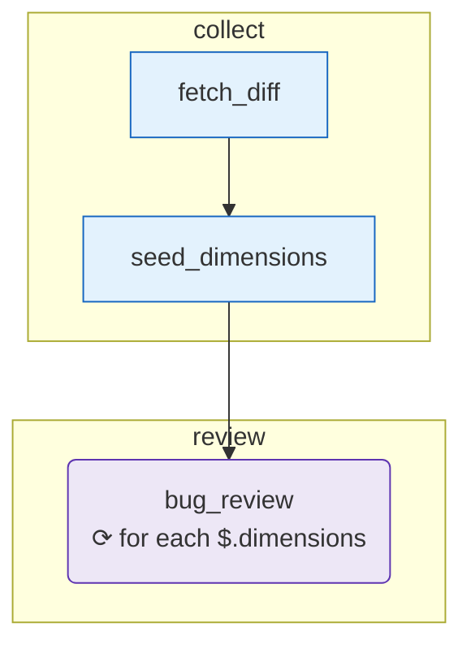

# Visualize & report

Two pure-output commands turn an experience and its runs into something you can paste into a README or open in a browser: `oe graph` (the static DAG) and `oe inspect --html` (a per-run report).

## When you need this

- You want a diagram of an experience's graph for a README, a PR description, or a design review.
- You finished a run and want a shareable, self-contained artifact showing what happened — node by node, with timings and tokens.
- You are explaining the shape of a flow to someone who will never run `oe`.

## `oe graph` — the experience DAG

`oe graph` renders an experience's graph as a Mermaid `flowchart`. It is a **pure transform** — no LLM call, no API key, no run required.

```bash
oe graph examples/review-branch
```



What the diagram encodes:

- **Phase subgraphs** — each `phase` becomes a labeled subgraph box.
- **Per-kind node shapes + colors** — `tool`, `agent`, `cli-agent`, `skill`, and nested-experience nodes each get a distinct Mermaid shape and `classDef` fill.
- **`for_each` annotation** — a fan-out node is labeled `⟳ for each <source>`.
- **Conditional `when:` edge labels** — an edge gated by a condition shows the condition as its label.

By default it prints Mermaid to stdout, so you can pipe or paste it straight into a GitHub README (GitHub renders ` ```mermaid ` blocks natively).

| Flag               | Effect                                                              |
| ------------------ | ------------------------------------------------------------------- |
| `--html`           | Wrap the diagram in a self-contained HTML page (opens in a browser) |
| `-o, --out <file>` | Write to a file instead of stdout                                   |
| `--lr`             | Left-to-right layout (default is top-down)                          |

```bash
oe graph examples/review-branch --html -o review-branch.html   # browser-ready page
oe graph examples/review-branch --lr                            # wide flows read better L→R
```

The `path` argument accepts an `experience.yaml` file or an experience directory and defaults to `.`.

::: tip Already embedded in the example pages
Every built-in [example](/examples/) page embeds its own `oe graph` output between `<!-- oe-graph:start -->` markers, regenerated by `pnpm docs:diagrams`. So you've already seen this command's output throughout the docs.
:::

## `oe inspect --html` — the run report

`oe inspect <run-id>` replays a run's JSONL event log to the terminal. Add `--html` to produce a **self-contained run report** instead — a single HTML file you can open or attach to a ticket:

```bash
oe inspect run_2026_05_28_143012_review-branch --html -o report.html
```

The report contains:

- **The DAG, colored by each node's status** — success / failed / skipped, so you see at a glance where the run went.
- **An events timeline** — every event in order (start, finished, failed, skipped, token metrics) with timestamps and details.
- **Per-node duration & tokens** — how long each node took and its `tokens_in` / `tokens_out`, plus the overall run status (`success` / `failed` / `partial`).

| Flag                  | Effect                                           |
| --------------------- | ------------------------------------------------ |
| `--experience <path>` | The experience directory (default `.`)           |
| `--html`              | Render the self-contained HTML run report        |
| `-o, --out <file>`    | Write the report to a file (with `--html`)       |
| `--lr`                | Left-to-right layout for the DAG (with `--html`) |

Without `--html`, `oe inspect` prints the event trail to the terminal (the form used throughout the [authoring walkthrough](/guide/authoring-ultra)).

## Gotchas

- **`oe graph` needs no key; `oe inspect` needs a run.** `oe graph` works on any valid experience. `oe inspect` reads `.openexpertise/runs/<run-id>.jsonl`, so the run must have happened (and you need the run id — `oe state run_id` after a run, or the id printed by `oe run`).
- **Token/duration columns depend on what the run logged.** Nodes that emitted no token metrics (e.g. tool nodes) show zero — that's expected, not a bug.
- **The HTML is self-contained but loads Mermaid for rendering.** The page references the Mermaid runtime to draw the diagram; the data itself is inlined.

## See also

- [`oe graph` CLI reference](/reference/cli/graph)
- [`oe inspect` CLI reference](/reference/cli/inspect)
- [Authoring with `oe ultra`](/guide/authoring-ultra) — `oe ultra --run` points you straight at `oe inspect … --html`
- [The TUI dashboard](/guide/tui) — the live view while a run is in flight
- [MCP server](/guide/mcp-server) — `oe_graph` returns the same Mermaid DAG to an MCP client
